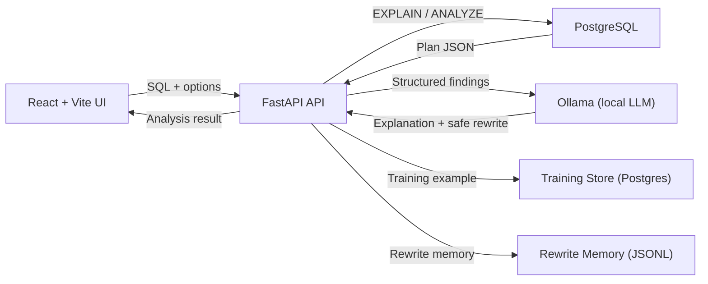
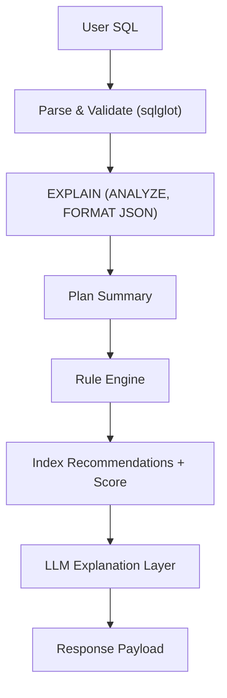
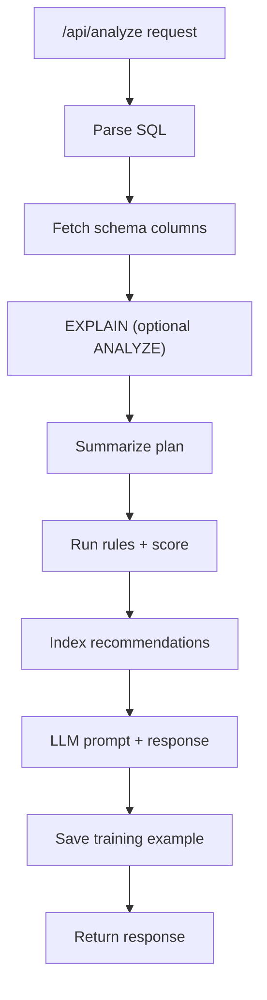

# QuerySense Architecture

This MVP follows a strict pipeline: **SQL → plan → rules → LLM → response**. Rule-based optimization happens first, and the LLM only explains or rewrites within the constraints of observed facts.

## System Diagram

## Analysis Pipeline

## Components

### Frontend
- React + Vite single-page app
- Chat-style interface with toggles for `EXPLAIN ANALYZE` and preview
- Live agent triggers debounced analysis on every edit
- Displays optimization score, “Why Slow”, optimized SQL, and index recommendations
- Shows live LLM logs and agent health metrics

### Backend
- FastAPI service, stateless per-request
- SQL parsing and validation via `sqlglot`
- Executes `EXPLAIN (ANALYZE, BUFFERS, FORMAT JSON)` for plan capture
- Runs deterministic rule engine
- Sends structured payload to local LLM (Ollama)
- Stores training data in PostgreSQL for future fine-tuning
- Persists rewrite memory for quick reuse

### Rule Engine
- Deterministic and explainable
- Operates on both SQL structure and plan nodes
- Emits findings with severity, evidence, and recommendations

### LLM Layer
- Local only (Ollama)
- Receives structured facts only
- Generates human-readable explanation and optional safe SQL rewrites
- Never executes queries
- Logs prompts/responses for the live log panel

### Database
- PostgreSQL instance with sample schema
- `EXPLAIN` runs in read-only transactions with a timeout
- Training data table stores analysis payloads and outputs

## Function Flow (API)

## Design Principles
- MVP first, correctness first, intelligence later, scale last
- Rule-based findings before ML
- LLM is explanation-only, never a source of truth
- All recommendations grounded in plan evidence
