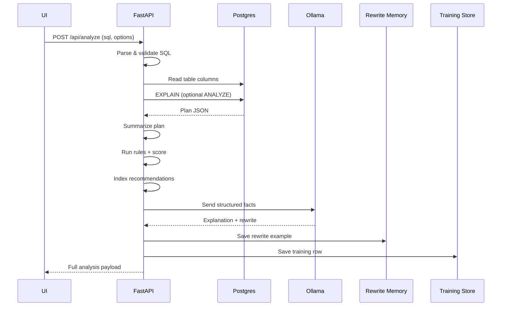

# Function Flow (Explain Like I'm 10)

This document explains what happens when you press **Run** or when the live agent analyzes your SQL.

## Big Picture
Think of the system like a classroom:
- **You** give a homework question (your SQL)
- **Rules** check obvious mistakes
- **The LLM** explains and suggests a better answer
- **The database** shows how hard the query is

## Step-by-step Flow

## Why It Is Safe
- The system **only runs SELECT queries**.
- It uses **read-only transactions** for preview and EXPLAIN.
- The LLM **never executes SQL**.

## Where Data Is Stored
- **Rewrite memory**: local JSONL file for fast reuse
- **Training store**: PostgreSQL table for future fine-tuning

## What The UI Shows
- **Optimization score** (grade + progress bar)
- **Why slow** (top rule issues)
- **Optimized query** (copy + diff)
- **Index recommendations**
- **LLM explanation**
- **Live LLM logs**
